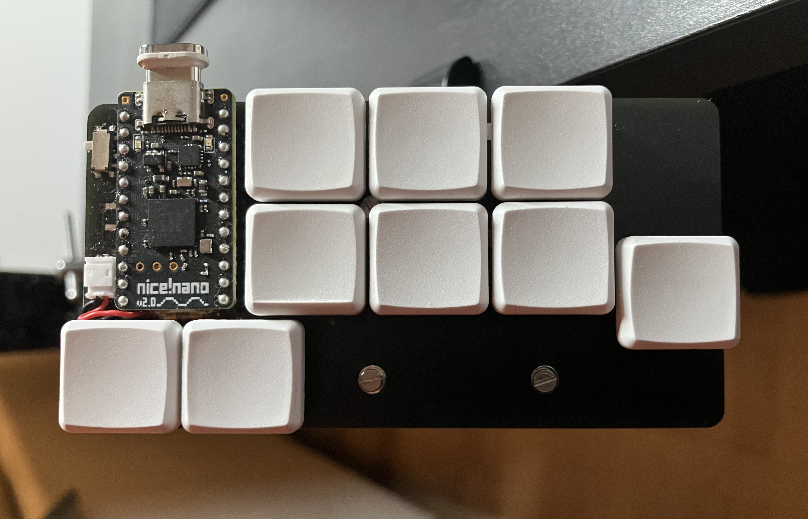

# Obelisk
After going through multiple revisions of Ben Vallack's piano board ([here](https://www.youtube.com/watch?v=M_VuXVErD6E)) I ended up coming back to this one since it was the most comfortable (and best looking imo) for me.

I usually don't enjoy column/row stagger (in this case on the pinky and thumb keys) and prefer simple, clean rows and columns but this layout proved to be the most comfortable and reliable in terms of hand placement and typing consistency. So I stuck with it.

## Specifications & Info:
* Choc-based (v1), 18-key, low-profile keyboard
* hotswap (only!)
* puck/tenting support
* wireless (only!)
* keymap [here](keymap/README.md)
* PCB [here](pcb/README.md)
* zmk repo [here](https://github.com/kunsteak/zmk-config-obelisk)

## Keyboard (right side):
